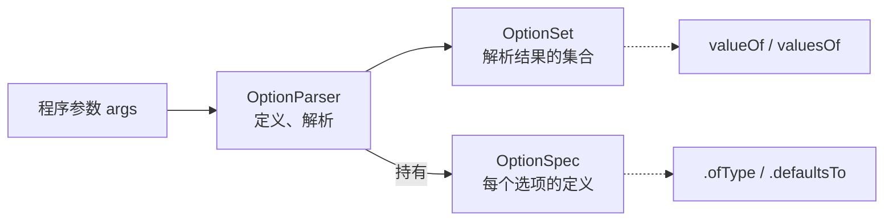

JOpt Simple 是一个轻量级的 Java 库，用于解析命令行参数。它遵循 POSIX 和 GNU 风格，力求用法简单直接。下面是一个基本示例：

```java
import joptsimple.OptionParser;
import joptsimple.OptionSet;

public class Main {
    public static void main(String[] args) {
        OptionParser parser = new OptionParser();
        parser.accepts("h", "显示帮助信息").forHelp(); // 定义 -h 为帮助选项
        parser.accepts("f", "输入文件").withRequiredArg().ofType(String.class); // 定义 -f，后必接一个字符串参数

        // parser.parse(args) 解析命令行参数，如果未提供必需参数或遇到未知选项会抛异常
        OptionSet options = parser.parse(args);

        if (options.has("h")) {
            parser.printHelpOn(System.out);
            System.exit(0);
        }

        String filename = (String) options.valueOf("f");
        System.out.println("输入文件: " + filename);
    }
}
```

下面是 JOpt Simple 的详细用法说明。

### 📥 1. 安装
在 Maven 项目的 `pom.xml` 中加入以下依赖即可：
```xml
<dependency>
  <groupId>net.sf.jopt-simple</groupId>
  <artifactId>jopt-simple</artifactId>
  <version>5.0.4</version> <!-- 截至2026年5月的最新稳定版 -->
</dependency>
```

### 🧱 2. 核心概念
JOpt Simple 的核心协作流程如下：


1.  **OptionParser (解析器)**：第一步，**定义**程序支持的选项，然后调用 `parse()` 方法**解析**命令行的字符串数组。
2.  **OptionSpec (选项规格)**：代表一个具体的选项定义。通过它，你可以获取该选项的参数值、设置默认值或限制参数类型。
3.  **OptionSet (选项集)**：`parser.parse(args)` 解析后返回的结果集合。可以查询哪些选项被设置了 (`has`)，并获取它们的参数值 (`valueOf`)。
4.  **非选项参数**：所有不以 `-` 开头的字符串（即不属于任何选项的参数），可通过 `options.nonOptionArguments()` 获取。

### ⚙️ 3. 基本用法
*   **定义选项**：使用 `parser.accepts("f")` 可定义短选项（`-f`），`parser.accepts("file")` 则定义长选项（`--file`）。
*   **设置别名**：使用 `parser.acceptsAll(Arrays.asList("f", "file"))` 可为选项设置多个别名。
*   **选项参数**：`withRequiredArg()` 表示该选项必须带参数，`withOptionalArg()` 则表示可选。
*   **类型转换**：通过 `.ofType(Integer.class)` 可将参数自动转为整型，支持所有具有以字符串为参数的单一构造器或静态工厂方法的类型。
*   **获取结果**：通过 `options.has(“file”)` 检查选项是否出现；使用 `options.valueOf(optionspec)` 或 `options.valuesOf(optionspec)` 获取单个或多个值。

### 💡 4. 高级用法
*   **默认值 (defaultsTo())**：为可选参数设置默认值。若命令行未提供，代码将返回设定的默认值。
*   **必须参数 (required())**：标记为 `.required()` 的选项若在解析时缺失，库会抛出 `MissingRequiredOptionException`。
*   **帮助选项 (forHelp())**：使用 `.forHelp()` 标记的选项，可在未提供必需参数的情况下正常运行，通常与 `parser.printHelpOn(System.out)` 联用。
*   **多值参数**：可多次指定同一选项累积参数值（如 `-p 1 -p 2`）；或使用 `.withValuesSeparatedBy(',')` 在单个参数内分隔（如 `-p 1,2`）。
*   **互斥选项 (mutuallyExclusive())**：用于定义一组选项，其中最多只能有一个在命令行中出现。
*   **参数文件解析 (@filename)**：库支持解析参数文件，可使用 `.parse()` 方法自动处理。

### 🧩 5. 完整示例
以下代码基本覆盖了上述所有要点，可直接运行测试：
```java
import joptsimple.OptionParser;
import joptsimple.OptionSet;
import joptsimple.OptionSpec;
import static java.util.Arrays.asList;

public class JoptSimpleDemo {
    public static void main(String[] args) {
        // 1. 创建解析器
        OptionParser parser = new OptionParser();
        
        // 2. 定义选项
        // --help (-h) : 帮助选项
        parser.acceptsAll(asList("h", "help"), "显示帮助信息").forHelp();
        // --file (-f) : 必须参数，接受文件路径
        parser.acceptsAll(asList("f", "file"), "输入文件路径")
              .withRequiredArg().ofType(String.class).required();
        // --count (-c) : 可选参数，有默认值，并假设接受数字 (需 ofType)
        parser.acceptsAll(asList("c", "count"), "执行次数")
              .withRequiredArg().ofType(Integer.class).defaultsTo(10);
        // --verbose (-v) : 布尔开关，无参数
        parser.acceptsAll(asList("v", "verbose"), "启用详细日志");
        // --items (-i) : 接受多个值，用逗号分隔
        parser.acceptsAll(asList("i", "items"), "处理项目列表 (逗号分隔)")
              .withRequiredArg().withValuesSeparatedBy(',');
        
        // 3. 解析参数
        OptionSet options = parser.parse(args);
        
        // 4. 检查帮助选项
        if (options.has("help")) {
            parser.printHelpOn(System.out);
            System.exit(0);
        }
        
        // 5. 读取结果
        String filename = (String) options.valueOf("file");
        // 类型安全版本
        OptionSpec<Integer> countSpec = parser.accepts("count").withRequiredArg().ofType(Integer.class);
        int count = options.valueOf(countSpec);
        boolean verbose = options.has("verbose");
        java.util.List<String> items = (java.util.List<String>) options.valuesOf("items");
        
        System.out.println("文件: " + filename);
        System.out.println("次数: " + count);
        System.out.println("详细模式: " + verbose);
        if (items != null && !items.isEmpty()) {
            System.out.println("项目列表: " + items);
        }
    }
}
```

### ⚠️ 6. 常见问题与故障排除
| 问题 | 可能原因 | 解决方案 |
| :--- | :--- | :--- |
| **未知选项异常** | 命令行传入了未定义的选项。 | 检查拼写，或在解析前为该选项添加 `parser.accepts()` 定义。 |
| **缺少必需参数** | 标记为 `required()` 的选项未提供，或其参数缺失。 | 确保必需选项已传入，且使用 `withRequiredArg()` 的选项后跟了值。 |
| **类型转换失败** | `options.valueOf(spec)` 获取的值类型与 `.ofType()` 定义不匹配。 | 确保传入值与期望类型兼容，或实现自定义转换逻辑。 |
| **短选项聚类异常** | 短选项聚类时误将后续字符识别为参数（例如 `-dabc` 可能被当作 `-d` 的参数 `abc`）。 | 避免将带参短选项与其他短选项聚类，或使用 `--` 明确分隔选项与参数。 |
| **帮助信息生成** | `parser.printHelpOn()` 调用时机或上下文不正确。 | 确保在 `parse()` 之前完成所有选项定义，并在检测到帮助标志后调用。 |
